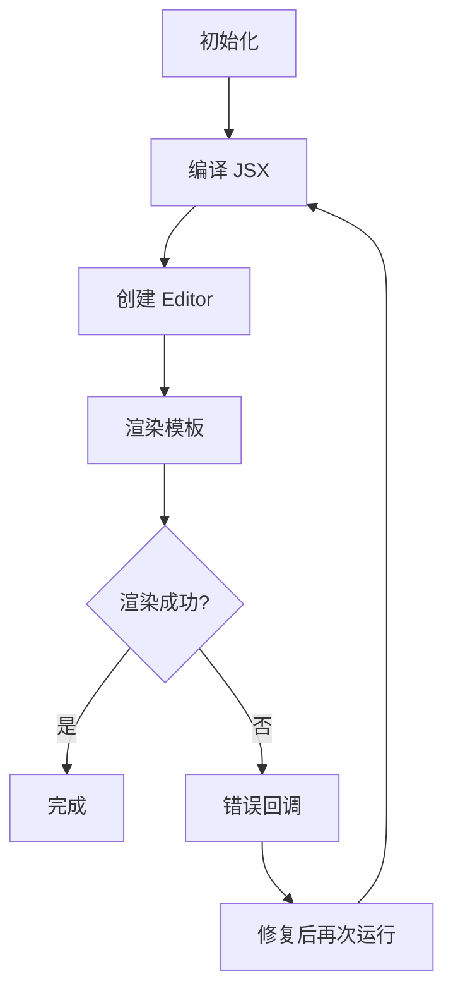
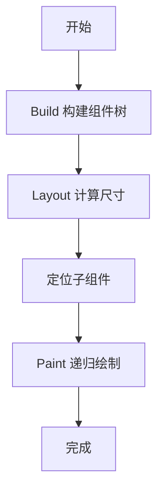

# 生命周期概览

Inkwell 的运行时以模板编译与渲染为核心，暴露 `onSuccess` 与 `onError` 回调，便于上层控制状态。

## 生命周期



## 渲染管线：Build → Layout → Paint

Inkwell 的渲染遵循三段式管线，构建组件树、计算布局、递归绘制。



- Build：通过 `build(context)` 生成或返回组件节点，入口见 `src/core/base.ts:325`。
- Layout：`layout(constraints)` 先对子组件计算尺寸，再确定自身尺寸并定位子组件，关键步骤位于 `src/core/base.ts:231`、`src/core/base.ts:284`、`src/core/base.ts:251`。
- Paint：`paint(context)` 先绘制自身，再保存/平移/递归绘制子组件并恢复状态，实现见 `src/core/base.ts:293` 与 `src/core/base.ts:319`。

### 调用顺序示意

```seq
participant App
participant Root as Widget
participant Child as Widget
participant Renderer

App->>Root: build(context)
Root->>Child: build(context)

App->>Root: layout(constraints)
Root->>Child: layout(childConstraints)
Root->>Root: performLayout(constraints, childrenSizes)
Root->>Root: positionChildren(childrenSizes)

App->>Root: paint(context)
Root->>Renderer: save()
Root->>Renderer: translate(offset)
Root->>Child: paint(context)
Child-->>Renderer: draw self
Root->>Renderer: restore()
```

