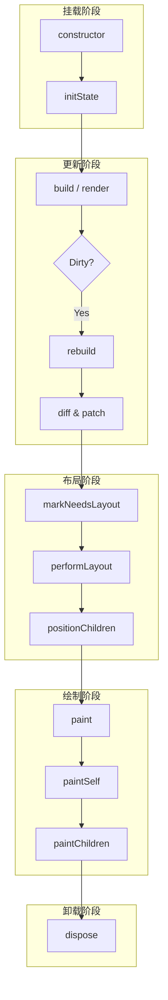

# 组件生命周期

Inkwell 的组件生命周期设计借鉴了 Flutter 和 React 的核心思想，分为四个主要阶段：**Mount（挂载/初始化）**、**Update（更新/构建）**、**Layout（布局）** 和 **Paint（绘制）**。

## 生命周期流程图



## 核心阶段详解

### 1. Mount (挂载)

组件被首次创建并插入到 Widget 树中。

| 方法 | 描述 | 典型用途 |
|------|------|----------|
| `constructor` | 组件实例化 | 初始化默认属性、Flex 配置、事件绑定 |
| `initState` | 状态初始化 (StatefulWidget) | 初始化 State，订阅事件，启动定时器 |

### 2. Update (更新)

当父组件重建、自身 State 改变 (`setState`) 或 `markDirty` 被调用时触发。

| 方法 | 描述 | 典型用途 |
|------|------|----------|
| `build` / `render` | 构建 UI 结构 | 组合子组件，返回新的 Widget 树 |
| `rebuild` | 框架内部机制 | 对比新旧数据 (Diff)，决定是否需要更新子树 |
| `createElement` | 更新元素 | 更新 Props，处理子节点的复用与重建 |

### 3. Layout (布局)

计算组件及其子组件的尺寸和位置。Inkwell 采用单次遍历的约束传递布局模型（Constraints Down, Sizes Up）。

| 方法 | 描述 | 典型用途 |
|------|------|----------|
| `markNeedsLayout` | 标记脏布局 | 通知框架当前节点需要重新计算布局 |
| `performLayout` | 执行布局计算 | **核心方法**。接收父级约束，计算自身 Size，并决定子节点尺寸 |
| `layoutChildren` | 布局子节点 | 将约束传递给子节点，获取子节点尺寸 |
| `positionChildren` | 定位子节点 | 在自身尺寸确定后，设置子节点的相对偏移量 (Offset) |

### 4. Paint (绘制)

将组件内容绘制到 Canvas 上。

| 方法 | 描述 | 典型用途 |
|------|------|----------|
| `paint` | 绘制入口 | 处理变换矩阵 (Transform)，保存/恢复 Canvas 上下文 |
| `paintSelf` | 绘制自身内容 | **核心方法**。使用 `context.renderer` 绘制形状、文本、图片等 |
| `paintChildren` | 绘制子节点 | 按 z-index 顺序递归绘制子组件 |

### 5. Unmount (卸载)

组件从树中移除。

| 方法 | 描述 | 典型用途 |
|------|------|----------|
| `dispose` | 销毁与清理 | 清理定时器、取消全局事件订阅、释放资源 |

## 状态更新机制

### setState

`StatefulWidget` 通过 `setState` 方法触发更新：

1.  合并新旧 State。
2.  调用 `markDirty()` 标记当前节点为脏节点。
3.  调度器 (Runtime) 在下一帧触发 `rebuild`。
4.  触发 `build` -> `Layout` -> `Paint` 流程。

```typescript
this.setState({ count: this.state.count + 1 });
```

### markNeedsLayout

当仅涉及尺寸改变而不涉及结构变化时（例如 ScrollView 滚动），可直接调用 `markNeedsLayout`：

1.  标记自身及所有父节点为 `_needsLayout`。
2.  调度器在下一帧仅触发 Layout 和 Paint 阶段，跳过 Build 阶段，提升性能。

## 最佳实践

1.  **避免在 `build` 中执行耗时操作**：`build` 方法可能会频繁调用，应保持纯净和快速。
2.  **合理使用 `paintSelf`**：仅在需要自定义绘制（如绘制图表、特殊形状）时实现 `paintSelf`，普通 UI 组合请使用 `build`。
3.  **Layout 边界**：如果你实现了一个自定义 Layout 组件，确保正确处理 `BoxConstraints`，特别是无界约束 (Unbounded Constraints)。
4.  **及时清理**：在 `dispose` 中务必清理手动添加的全局监听器或定时器，防止内存泄漏。
