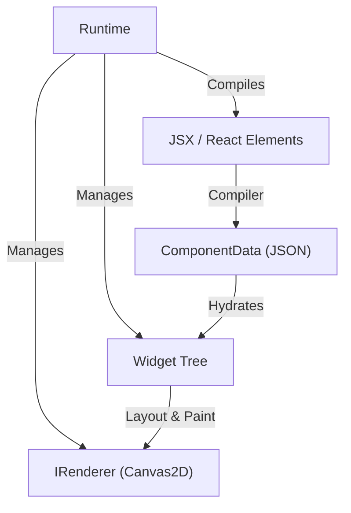

# 架构设计

Inkwell 的核心架构深受 Flutter 启发，但针对 React 生态进行了适配。它提供了一个高性能、声明式的 Canvas UI 渲染系统。

## 系统概览

Inkwell 的运行时（Runtime）负责协调整个渲染流程。它管理着 Widget 树、渲染器（Renderer）以及更新循环（Tick）。



## 核心概念 

### 1. Widget
Widget 是 UI 的基本构建块。在 Inkwell 中，Widget 既是配置也是逻辑载体。

- **Widget (Abstract)**: 所有组件的基类。定义了 `layout`, `paint`, `hitTest` 等核心方法。
  - 包含 `RenderObject`：存储布局结果（`offset`, `size`）。
  - 包含 `BoxConstraints`：父级传递的布局约束。
  - 包含 `BuildContext`：提供渲染上下文（如 `worldMatrix`, `renderer`）。
- **StatelessWidget**: 用于组合其他 Widget，不维护内部状态。通过 `render()` 方法返回子组件结构。
- **StatefulWidget**: 维护内部 `State`，状态变化会触发组件及其子树的重建。

### 2. Runtime
`Runtime` 是整个引擎的指挥官。
- **调度更新**: 维护 `dirtyWidgets` 集合，通过 `requestAnimationFrame` 批量处理布局和重绘。
- **JSX 编译**: 通过 `renderFromJSX` 将 JSX 元素编译为 `ComponentData`，再转换为 Widget 树。
- **生命周期**: 管理 Widget 的挂载、更新和卸载。

### 3. RenderObject
虽然没有独立的 `RenderObject` 类层次结构，但每个 `Widget` 实例都持有一个 `renderObject` 属性，用于存储布局和渲染状态。
- **Layout**: 接收 `BoxConstraints`，计算自身 `Size`。
- **Paint**: 使用 `IRenderer` 接口进行绘制。支持局部坐标系转换（Transform）。
- **HitTest**: 基于布局信息进行点击检测。

### 4. Compiler (JSX Compiler)
位于 `src/utils/compiler`，负责将 React 的 JSX 语法转换为 Inkwell 可理解的中间格式 (`ComponentData`)。
- **compileElement**: 将 JSX Element 转换为 JSON 描述。支持**函数式组件**的自动展开（Inline Expansion）。
- **WidgetRegistry**: 负责 Widget 类型的注册和查找，确保 JSON 可以被正确实例化。

## 渲染管线 (Rendering Pipeline)

1.  **Compile & Build**: 
    - 用户编写 JSX。
    - `Runtime` 调用 `compileElement` 生成数据。
    - 数据被实例化为 `Widget` 树。
2.  **Dirty Check**:
    - `setState` 或 `markNeedsLayout` 标记 Widget 为脏（dirty）。
    - `Runtime.tick` 收集脏节点。
3.  **Layout**: 
    - 从根节点或脏节点开始，向下传递 `Constraints`。
    - Widget 计算自身大小，并向上返回 `Size`。
    - `RenderObject` 更新 `offset` 和 `size`。
4.  **Paint**: 
    - `Runtime` 清除画布。
    - 遍历 Widget 树，计算世界变换矩阵（World Matrix）。
    - 调用 Widget 的 `paint` 方法，通过 `IRenderer` 绘制图形。

## 事件系统 (Event System)

- **EventRegistry**: 注册和管理事件监听器。
- **Dispatcher**: 
    - 监听 Canvas 容器的原生事件。
    - 执行 Hit Test 找到目标 Widget。
    - 模拟事件冒泡（Bubbling），将事件分发给 Widget 及其父级。

## 关键接口

### Widget
```typescript
abstract class Widget<TData extends WidgetProps = WidgetProps> {
  // 布局
  abstract performLayout(constraints: BoxConstraints, childrenSizes: Size[]): Size;
  // 绘制
  paint(context: BuildContext): void;
  // 交互
  hitTest(x: number, y: number): boolean;
}
```

### BuildContext
```typescript
interface BuildContext {
  renderer: IRenderer;
  worldMatrix?: [number, number, number, number, number, number];
}
```

### IRenderer
抽象渲染层，目前实现为 `Canvas2DRenderer`。
```typescript
interface IRenderer {
  save(): void;
  restore(): void;
  translate(x: number, y: number): void;
  // ... 绘制指令
}
```
