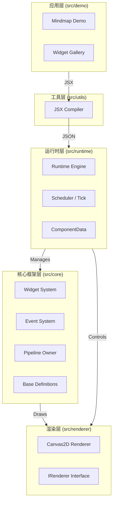

# 架构设计

本文档详细描述 Inkwell 框架的架构设计、模块划分及运行时机制。

## 1. 核心架构图

Inkwell 采用分层架构设计，自底向上分为：**渲染层**、**运行时层**、**核心框架层**和**应用层**。



## 2. 核心模块划分

参考 `src` 目录结构，主要模块如下：

### 2.1 Runtime (运行时) - `src/runtime`
整个引擎的"心脏"。
- **Runtime Class**: 负责初始化环境、管理 Canvas 实例、持有根节点 (`rootWidget`)。
- **Tick Loop**: 通过 `requestAnimationFrame` 驱动渲染循环。
- **Error Handling**: 捕获渲染错误并以覆盖层形式展示（类似 Flutter 的红屏报错）。

### 2.2 Core (核心框架) - `src/core`
构建 UI 的基础构件。
- **Widget Base** (`src/core/base.ts`): 定义了 `Widget` 抽象基类。
    - **统一树结构**: Inkwell 的 Widget 实例同时包含配置信息、状态（`State`）和布局渲染逻辑（类似 Flutter 的 `RenderObject`）。
- **Pipeline** (`src/core/pipeline`): `PipelineOwner` 负责管理布局和绘制的脏列表 (`_nodesNeedingLayout`, `_nodesNeedingPaint`)，并执行 `flushLayout` 和 `flushPaint`。
- **Events** (`src/core/events`): 实现了类似 DOM 的事件冒泡机制。`Dispatcher` 负责将原生 Canvas 事件转换为 Inkwell 事件。

### 2.3 Renderer (渲染器) - `src/renderer`
- **IRenderer**: 定义绘制接口（如 `drawRect`, `drawText`）。
- **Canvas2DRenderer**: 基于 HTML5 Canvas 2D Context 的具体实现。支持离屏渲染优化。

### 2.4 Compiler (编译器) - `src/utils/compiler`
- **compileElement**: 在运行时将 React JSX 元素转换为轻量级的 JSON 数据 (`ComponentData`)，供 `Runtime` 消费。这使得我们可以使用 React 的语法，但不依赖 React 的 Reconciler。

## 3. 运行时机制

Inkwell 的渲染流程是**按需更新**的。

### 3.1 启动流程
参考 `src/demo/mindmap/app.tsx`:
```typescript
export function runApp(runtime: Runtime, width: number, height: number): void {
  // 1. 编译 JSX 为 ComponentData
  // 2. Runtime 创建 Widget 树
  // 3. 触发初始 Layout 和 Paint
  runtime.render(<MindmapDemo width={width} height={height} />);
}
```

### 3.2 更新循环 (The Tick)
当组件状态改变时（例如 `setState`）：
1.  **Mark Dirty**: 调用 `markNeedsLayout()` 或 `markNeedsPaint()`。
2.  **Schedule**: 组件被加入 `PipelineOwner` 的脏列表中。`Runtime` 请求下一帧。
3.  **Flush Layout**:
    - `Runtime` 调用 `pipelineOwner.flushLayout()`。
    - 按**深度优先**顺序遍历脏节点。
    - 执行 `layout()` 计算尺寸（遵循 Constraints 协议）。
4.  **Flush Paint**:
    - `Runtime` 清除画布。
    - 从根节点开始遍历绘制（或仅重绘 `RepaintBoundary`）。

### 3.3 布局协议
与 Flutter 一致：
> **Constraints go down. Sizes go up. Parent sets position.**

```typescript
// src/core/base.ts (简化)
abstract class Widget {
  // 父级传递 constraints，返回自身 size
  abstract layout(constraints: BoxConstraints): Size;
  
  // 渲染自身
  abstract paint(context: BuildContext): void;
}
```

## 4. 与 Flutter 的主要差异

尽管设计深受 Flutter 启发，但为了适应 Web 和 JS 生态，Inkwell 做了以下权衡：

| 特性 | Flutter | Inkwell | 原因 |
| :--- | :--- | :--- | :--- |
| **树结构** | **三棵树** (Widget, Element, RenderObject) | **单棵树** (Widget 实例) | 简化 JS 对象模型，减少 GC 压力；降低理解成本。 |
| **语言** | Dart | TypeScript + JSX | 利用 React 生态和前端开发者的现有技能。 |
| **编译方式** | AOT / JIT | Runtime Compilation (JSX -> JSON) | 保持动态性，允许在浏览器中直接运行 JSX。 |
| **布局系统** | RenderBox | Widget 内置 layout 方法 | 由于单树结构，布局逻辑直接存在于 Widget 中。 |

### 差异详解：单树结构
在 Flutter 中，`Widget` 是不可变的配置，`Element` 管理生命周期，`RenderObject` 管理渲染。
在 Inkwell 中，为了减少对象创建（JS 引擎对大量短生命周期对象敏感），我们将这三者合并：
- `Widget` 类实例是可变的（Mutable）。
- 它持有 `props` (Configuration)。
- 它持有 `state` (State management)。
- 它直接实现 `layout` 和 `paint` (Render logic)。

这种设计使得 Inkwell 更像是一个 "Stateful Render Object Tree"。

## 5. 代码示例

### 自定义组件
```typescript
// src/demo/mindmap/widgets/mindmap-node/index.tsx
export class MindMapNode extends StatefulWidget<NodeProps, NodeState> {
  constructor(props: NodeProps) {
    super(props);
    this.state = { hover: false };
  }

  // 布局实现
  layout(constraints: BoxConstraints): Size {
    // 测量文本，计算宽高
    const textSize = measureText(this.props.title);
    return { width: textSize.width + 20, height: 40 };
  }

  // 绘制实现
  paint(context: BuildContext): void {
    const { canvas } = context;
    // 绘制背景
    canvas.drawRect({ color: this.state.hover ? 'blue' : 'gray' });
    // 绘制文本
    canvas.drawText(this.props.title, { x: 10, y: 20 });
  }
}
```
