# 生命周期

Inkwell 的组件生命周期参考了常见的 UI 框架模型，整体可以拆分为四个主要阶段：**Mount（挂载/初始化）**、**Update（更新）**、**Layout（布局）** 和 **Paint（绘制）**。

## 生命周期流程图

```mermaid
graph LR
    subgraph Mount["挂载阶段"]
        A["constructor"] --> B["initWidget"]
    end

    subgraph Update["更新阶段"]
        B --> C["createElement(props)"]
        C --> D["render() 编译子树"]
        D --> E{"dirty?"}
        E -- "是" --> F["rebuild"]
        F --> G["子节点复用/增删"]
    end

    subgraph Layout["布局阶段"]
        G --> H["markNeedsLayout"]
        H --> I["layout"]
        I --> J["performLayout"]
        J --> K["positionChildren"]
    end

    subgraph Paint["绘制阶段"]
        K --> L["markNeedsPaint"]
        L --> M["paint"]
        M --> N["paintSelf"]
        N --> O["递归绘制子节点"]
    end

    subgraph Unmount["卸载阶段"]
        P["dispose"]
    end

    O --> P
```



## 核心阶段详解

### 1. Mount (挂载)

组件被首次创建并插入到 Widget 树中。

| 方法 | 描述 | 典型用途 |
|------|------|----------|
| `constructor` | 组件实例化 | 初始化字段、缓存、订阅句柄等 |
| `initWidget` | 一次性初始化钩子 | 初始化状态、订阅事件、启动定时器等（只会调用一次） |
| `isMounted` | 挂载状态检查 | 判断当前节点是否已经接入 `PipelineOwner`（具备布局/绘制调度能力） |

`initWidget` 是 Inkwell 的“一次性初始化”入口。`StatelessWidget/StatefulWidget` 会在首次 `createElement` 时确保调用它。

### 2. Update (更新)

当父组件重建或自身 State 改变（`setState` -> 内部调用 `markDirty`）时触发。

| 方法 | 描述 | 典型用途 |
|------|------|----------|
| `createElement` | 接收新 Props 并更新 | 框架更新入口（数据更新、子节点复用、必要时触发生命周期） |
| `render` | 返回声明式子树 | `StatelessWidget/StatefulWidget` 通过 `render()` 返回 JSX（或等价元素），由编译器转为 `ComponentData` |
| `didUpdateWidget` | 响应 Props 变更 | 对比新旧 Props，同步内部状态或处理副作用；默认行为是 `markNeedsLayout()` |
| `rebuild` | 脏节点重建 | 由 Runtime 批量消费脏节点，驱动子树更新 |
| `markDirty` | 标记脏节点 | **核心方法**。用于触发更新流程，并会级联触发 `markNeedsLayout`。对 `StatefulWidget` 通常应使用 `setState` 触发更新。 |

#### API 详解: `didUpdateWidget`

```typescript
/**
 * 当组件配置发生变化时调用
 * @param oldProps 旧的组件属性
 */
protected didUpdateWidget(oldProps: TData): void
```

- **触发条件**: 同一节点（type 匹配且 key 匹配，或无 key 且可复用）收到新 Props 时触发。
- **执行时机**: `Widget.createElement` 更新完 `props/data` 后调用；对于 `StatefulWidget`，会在 `render` 编译子树之前先调用一次，便于先同步 `state` 再渲染。
- **典型场景**:
    - **State 同步**: 当外部 Props 变化时（如 `value`），更新内部 State。
    - **副作用重置**: 比如重置动画控制器、定时器或滚动位置。
    - **性能优化**: 比较 Props 决定是否需要发起昂贵的计算或网络请求。

**示例**：
```typescript
class MyInput extends StatefulWidget<MyProps, MyState> {
  protected didUpdateWidget(oldProps: MyProps) {
    // 只有当 value 真正改变时才更新 state
    if (this.props.value !== oldProps.value) {
      this.setState({
        value: this.props.value,
      });
    }
    super.didUpdateWidget(oldProps);
  }
}
```

#### API 详解: `markDirty`

```typescript
/**
 * 标记组件为"脏"状态，请求重新构建
 * 触发路径：markDirty -> scheduleUpdate -> rebuild -> layout -> paint
 */
public markDirty(): void
```

- **触发条件**: 状态改变，需要重新运行子树计算与重建逻辑（`computeNextChildrenData` / 复合组件的 `render()` 编译）。
- **执行流程**:
    1. 设置 `_dirty = true`。
    2. 调用 `runtime.scheduleUpdate(this)` 将自身加入 Runtime 的全局脏节点列表。
    3. 自动调用 `markNeedsLayout()`，确保更新后的结构能被正确布局。

### 3. Layout (布局)

计算组件及其子组件的尺寸和位置。Inkwell 采用单次遍历的约束传递布局模型（Constraints Down, Sizes Up）。

| 方法 | 描述 | 典型用途 |
|------|------|----------|
| `markNeedsLayout` | 标记脏布局 | **核心方法**。通知框架当前节点布局失效。会自动向上寻找最近的**重布局边界 (Relayout Boundary)**，从而避免全树重新布局。 |
| `layout` | 布局入口 | 基类统一入口：缓存约束、布局子节点、调用 `performLayout`、再定位子节点 |
| `performLayout` | 执行布局计算 | 子类覆写：接收父级约束与子节点尺寸，返回自身 `Size` |
| `getConstraintsForChild` | 子节点约束 | 子类可覆写：为不同子节点生成不同约束 |
| `positionChild` | 子节点定位 | 子类可覆写：在自身尺寸确定后为子节点计算 `Offset` |

#### API 详解: `markNeedsLayout`

```typescript
/**
 * 标记布局失效
 * 触发路径：markNeedsLayout -> (upwards to RelayoutBoundary) -> scheduleLayout -> flushLayout
 */
public markNeedsLayout(): void
```

- **触发条件**: 修改了 `width`, `height`, `flex`, `padding` 等影响几何属性的值。
- **优化机制**:
    - 如果当前节点是 **Relayout Boundary**（如根节点或大小固定的节点），则停止向上传播，直接调度自身布局。
    - 否则，递归调用 `parent.markNeedsLayout()`。

### 4. Paint (绘制)

将组件内容绘制到 Canvas 上。

| 方法 | 描述 | 典型用途 |
|------|------|----------|
| `markNeedsPaint` | 标记脏绘制 | **核心方法**。通知框架当前节点外观已改变。会自动向上寻找最近的**重绘边界 (Repaint Boundary)**，实现局部重绘。 |
| `paint` | 绘制入口 | 处理变换矩阵 (Transform)，保存/恢复 Canvas 上下文 |
| `paintSelf` | 绘制自身内容 | **核心方法**。使用 `context.renderer` 绘制形状、文本、图片等 |
| `isRepaintBoundary` | 重绘边界属性 | **核心属性**。设置为 `true` 时，该组件及其子树将形成独立的绘制层。子组件重绘不会污染父组件，父组件重绘也不必重绘子组件。 |
| `updateLayer` | 更新渲染层 | 当 `isRepaintBoundary` 为 true 时，用于管理缓存的 Layer 对象。 |

#### API 详解: `markNeedsPaint`

```typescript
/**
 * 标记绘制失效
 * 触发路径：markNeedsPaint -> (upwards to RepaintBoundary) -> schedulePaint -> flushPaint
 */
public markNeedsPaint(): void
```

- **触发条件**: 修改了 `color`, `opacity` 等仅影响外观的属性。
- **优化机制**:
    - 向上查找最近的 `isRepaintBoundary = true` 的节点。
    - 仅重绘该边界内的内容，边界外的父节点只需合成缓存的 Layer。

### 5. Unmount (卸载)

组件从树中移除。

| 方法 | 描述 | 典型用途 |
|------|------|----------|
| `dispose` | 销毁与清理 | 清理定时器、取消全局事件订阅、释放资源 |

## 状态更新机制

### setState

`StatefulWidget` 通过 `setState` 方法触发更新：

1.  合并新旧 State。
2.  调用 `markDirty()` 标记当前节点为脏节点。
3.  调度器 (Runtime) 在下一帧触发 `rebuild`。
4.  触发 `rebuild`（编译/复用子树）-> `Layout` -> `Paint` 流程。

```typescript
this.setState({ count: this.state.count + 1 });
```

### markNeedsLayout

当仅涉及尺寸改变而不涉及结构变化时（例如 ScrollView 滚动），可直接调用 `markNeedsLayout`：

1.  标记自身及所有父节点为 `_needsLayout`。
2.  调度器在下一帧仅触发 Layout 和 Paint 阶段，跳过 Build 阶段，提升性能。

## 最佳实践

1.  **避免在子树计算阶段执行耗时操作**：`rebuild` 可能会频繁触发，应保持纯净和快速，避免分配大量临时对象。
2.  **避免在 `render` 中执行耗时操作**：`render()` 可能会频繁执行，应保持纯净与快速，避免分配大量临时对象。
3.  **合理使用 `paintSelf`**：仅在需要自定义绘制（如绘制图表、特殊形状）时实现 `paintSelf`，普通 UI 组合优先使用 `StatelessWidget/StatefulWidget` 的声明式 `render()`。
3.  **Layout 边界**：如果你实现了一个自定义 Layout 组件，确保正确处理 `BoxConstraints`，特别是无界约束 (Unbounded Constraints)。
4.  **及时清理**：在 `dispose` 中务必清理手动添加的全局监听器或定时器，防止内存泄漏。
