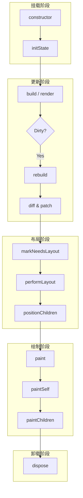

# 生命周期

Inkwell 的组件生命周期设计借鉴了 Flutter 和 React 的核心思想，分为四个主要阶段：**Mount（挂载/初始化）**、**Update（更新/构建）**、**Layout（布局）** 和 **Paint（绘制）**。

## 生命周期流程图



## 核心阶段详解

### 1. Mount (挂载)

组件被首次创建并插入到 Widget 树中。Inkwell 实现了安全的初始化流程，确保组件在未完全挂载前（即没有 owner/parent 时）修改属性不会导致布局系统的异常。

| 方法 | 描述 | 典型用途 |
|------|------|----------|
| `constructor` | 组件实例化 | 初始化默认属性、Flex 配置、事件绑定 |
| `initState` | 状态初始化 (StatefulWidget) | 初始化 State，订阅事件，启动定时器 |
| `isMounted` | 挂载状态检查 | **v0.8.0 新增**。检查组件是否已连接到 PipelineOwner。用于防止游离组件触发不必要的布局更新。 |

> **初始化安全机制**：
> 当在 `constructor` 或初始化阶段修改属性（如 Text 组件设置初始文本）触发 `markNeedsLayout` 时，框架会自动检测 `isMounted` 状态。如果组件尚未挂载，布局请求会被安全抑制或延迟，直到组件接入组件树，避免了"Trying to mark layout on a detached node"类警告。

### 2. Update (更新)

当父组件重建、自身 State 改变 (`setState`) 或 `markDirty` 被调用时触发。

| 方法 | 描述 | 典型用途 |
|------|------|----------|
| `build` / `render` | 构建 UI 结构 | 组合子组件，返回新的 Widget 树 |
| `didUpdateWidget` | 响应属性变更 | **v0.9.0 新增**。当组件接收到新的 Props 时触发。用于比较新旧 Props，同步内部 State 或执行副作用。在 `render` 之前调用。 |
| `rebuild` | 框架内部机制 | 对比新旧数据 (Diff)，决定是否需要更新子树 |
| `markDirty` | 标记脏节点 | **核心方法**。手动触发更新流程。不仅标记脏状态，还会级联触发 `markNeedsLayout`，确保视图数据同步。 |

#### API 详解: `didUpdateWidget`

```typescript
/**
 * 当组件配置发生变化时调用
 * @param oldProps 旧的组件属性
 */
protected didUpdateWidget(oldProps: TData): void
```

- **触发条件**: 父组件重建导致当前组件接收到新的 Props，且 Key 相同（或无 Key 且类型相同）被复用时。
- **执行时机**: 在 `render` 之前调用。
- **典型场景**:
    - **State 同步**: 当外部 Props 变化时（如 `value`），更新内部 State。
    - **副作用重置**: 比如重置动画控制器、定时器或滚动位置。
    - **性能优化**: 比较 Props 决定是否需要发起昂贵的计算或网络请求。

**示例**：
```typescript
class MyInput extends StatefulWidget<MyProps, MyState> {
  protected didUpdateWidget(oldProps: MyProps) {
    // 只有当 value 真正改变时才更新 state
    if (this.props.value !== oldProps.value) {
      this.setState({
        value: this.props.value
      });
    }
    super.didUpdateWidget(oldProps);
  }
}
```

#### API 详解: `markDirty`

```typescript
/**
 * 标记组件为"脏"状态，请求重新构建
 * 触发路径：markDirty -> scheduleUpdate -> rebuild -> layout -> paint
 */
public markDirty(): void
```

- **触发条件**: 状态改变，需要重新运行 `build` 逻辑。
- **执行流程**:
    1. 设置 `_dirty = true`。
    2. 调用 `runtime.scheduleUpdate(this)` 将自身加入 Runtime 的全局脏节点列表。
    3. 自动调用 `markNeedsLayout()`，确保更新后的结构能被正确布局。

### 3. Layout (布局)

计算组件及其子组件的尺寸和位置。Inkwell 采用单次遍历的约束传递布局模型（Constraints Down, Sizes Up）。

| 方法 | 描述 | 典型用途 |
|------|------|----------|
| `markNeedsLayout` | 标记脏布局 | **核心方法**。通知框架当前节点布局失效。会自动向上寻找最近的**重布局边界 (Relayout Boundary)**，从而避免全树重新布局。 |
| `performLayout` | 执行布局计算 | **核心方法**。接收父级约束，计算自身 Size，并决定子节点尺寸 |
| `layoutChildren` | 布局子节点 | 将约束传递给子节点，获取子节点尺寸 |
| `positionChildren` | 定位子节点 | 在自身尺寸确定后，设置子节点的相对偏移量 (Offset) |

#### API 详解: `markNeedsLayout`

```typescript
/**
 * 标记布局失效
 * 触发路径：markNeedsLayout -> (upwards to RelayoutBoundary) -> scheduleLayout -> flushLayout
 */
public markNeedsLayout(): void
```

- **触发条件**: 修改了 `width`, `height`, `flex`, `padding` 等影响几何属性的值。
- **优化机制**:
    - 如果当前节点是 **Relayout Boundary**（如根节点或大小固定的节点），则停止向上传播，直接调度自身布局。
    - 否则，递归调用 `parent.markNeedsLayout()`。

### 4. Paint (绘制)

将组件内容绘制到 Canvas 上。

| 方法 | 描述 | 典型用途 |
|------|------|----------|
| `markNeedsPaint` | 标记脏绘制 | **核心方法**。通知框架当前节点外观已改变。会自动向上寻找最近的**重绘边界 (Repaint Boundary)**，实现局部重绘。 |
| `paint` | 绘制入口 | 处理变换矩阵 (Transform)，保存/恢复 Canvas 上下文 |
| `paintSelf` | 绘制自身内容 | **核心方法**。使用 `context.renderer` 绘制形状、文本、图片等 |
| `paintChildren` | 绘制子节点 | 按 z-index 顺序递归绘制子组件 |
| `isRepaintBoundary` | 重绘边界属性 | **核心属性**。设置为 `true` 时，该组件及其子树将形成独立的绘制层。子组件重绘不会污染父组件，父组件重绘也不必重绘子组件。 |
| `updateLayer` | 更新渲染层 | 当 `isRepaintBoundary` 为 true 时，用于管理缓存的 Layer 对象。 |

#### API 详解: `markNeedsPaint`

```typescript
/**
 * 标记绘制失效
 * 触发路径：markNeedsPaint -> (upwards to RepaintBoundary) -> schedulePaint -> flushPaint
 */
public markNeedsPaint(): void
```

- **触发条件**: 修改了 `color`, `opacity` 等仅影响外观的属性。
- **优化机制**:
    - 向上查找最近的 `isRepaintBoundary = true` 的节点。
    - 仅重绘该边界内的内容，边界外的父节点只需合成缓存的 Layer。

### 5. Unmount (卸载)

组件从树中移除。

| 方法 | 描述 | 典型用途 |
|------|------|----------|
| `dispose` | 销毁与清理 | 清理定时器、取消全局事件订阅、释放资源 |

## 状态更新机制

### setState

`StatefulWidget` 通过 `setState` 方法触发更新：

1.  合并新旧 State。
2.  调用 `markDirty()` 标记当前节点为脏节点。
3.  调度器 (Runtime) 在下一帧触发 `rebuild`。
4.  触发 `build` -> `Layout` -> `Paint` 流程。

```typescript
this.setState({ count: this.state.count + 1 });
```

### markNeedsLayout

当仅涉及尺寸改变而不涉及结构变化时（例如 ScrollView 滚动），可直接调用 `markNeedsLayout`：

1.  标记自身及所有父节点为 `_needsLayout`。
2.  调度器在下一帧仅触发 Layout 和 Paint 阶段，跳过 Build 阶段，提升性能。

## 最佳实践

1.  **避免在 `build` 中执行耗时操作**：`build` 方法可能会频繁调用，应保持纯净和快速。
2.  **合理使用 `paintSelf`**：仅在需要自定义绘制（如绘制图表、特殊形状）时实现 `paintSelf`，普通 UI 组合请使用 `build`。
3.  **Layout 边界**：如果你实现了一个自定义 Layout 组件，确保正确处理 `BoxConstraints`，特别是无界约束 (Unbounded Constraints)。
4.  **及时清理**：在 `dispose` 中务必清理手动添加的全局监听器或定时器，防止内存泄漏。
