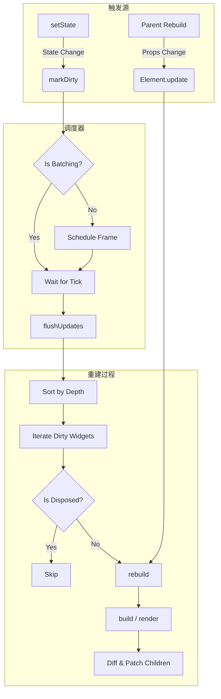
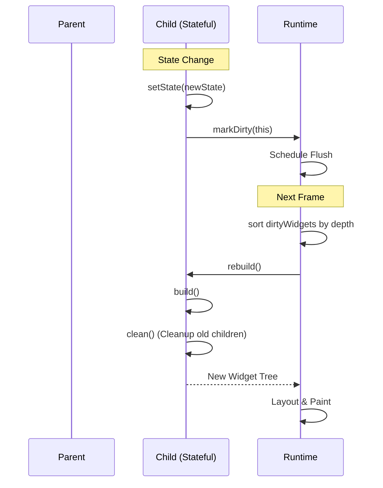

# 更新机制

本文档详细解析 Inkwell 框架的组件更新机制，并结合近期的核心更新说明如何优化渲染性能。

## 1. 更新触发机制

组件更新主要由 `Props` 变化或 `State` 变化触发。

### 1.1 State 变化

当 `StatefulWidget` 调用 `setState` 时，会触发以下流程：

1.  **合并状态**: 新状态合并入当前状态。
2.  **标记脏节点**: 调用 `markDirty()`，将当前组件加入全局 `Runtime` 的脏节点列表 (`dirtyWidgets`)。
3.  **调度更新**: `Runtime` 请求下一帧动画帧 (`requestAnimationFrame`)。
4.  **批量刷新**: 在下一帧开始时，`Runtime` 执行 `flushUpdates()`，遍历脏节点列表进行重建。

### 1.2 Props 变化

当父组件重建（Rebuild）时，会重新构建子组件树：

1.  **父组件 Build**: 父组件执行 `build()` 方法，生成新的 Widget 配置数据。
2.  **子组件更新**: 框架对比新旧 Widget 配置。
3.  **Element 更新**: 调用子组件 Element 的 `update()` 方法，传入新的 Props。
4.  **重建**: 子组件被标记为需要重建，并在当前遍历中立即执行 `rebuild`（递归过程）。

## 2. 更新流程可视化

### 2.1 完整更新生命周期

### 2.2 关键 Hook 执行时序

## 3. 核心优化策略

近期框架进行了三次主要更新，重点优化了更新机制以减少不必要的渲染。

### 3.1 深度优先更新 (Depth-Based Scheduling)

**问题**: 在旧版本中，如果父组件和子组件在同一帧内都调用了 `setState`，运行时可能会先处理子组件，然后父组件重建时再次更新子组件，导致子组件渲染两次。

**优化**: `Runtime` 现在维护组件的 `depth` (深度) 属性。在 `flushUpdates` 时，按 `depth` 从小到大（父到子）排序。
-   先处理父组件。
-   父组件重建时，如果更新了子组件的 Props，子组件会被移出脏列表（或标记为已处理），避免重复渲染。

### 3.2 智能脏列表管理

**优化**:
-   **跳过已销毁组件**: 在遍历脏列表时，增加 `isDisposed()` 检查。如果组件在等待更新期间被卸载，直接跳过。
-   **重复检测**: 如果一个组件已经被父组件更新过，再次遇到它时会跳过。

## 4. 性能优化最佳实践

### 4.1 避免在 Render 中执行副作用

不要在 `render` 或 `build` 方法中调用 `setState` 或触发会导致更新的函数。这会导致无限循环或不可预测的渲染行为。

### 4.2 合理使用 Keys

在列表渲染中，务必提供唯一且稳定的 `key`。
-   **错误**: `key={Math.random()}` (导致每次都卸载重挂载)
-   **错误**: `key={index}` (导致列表重排时状态错乱)
-   **正确**: `key={item.id}`

### 4.3 状态管理原则

-   **状态提升**: 如果两个组件的状态需要同步，将状态提升到共同的父组件。
-   **单一数据源**: 避免 "Props 衍生 State" 的反模式，尽量直接使用 Props。

### 4.4 谨慎使用 Ref 触发更新

通过 `ref` 直接调用子组件方法修改状态（如 `changeColor`）虽然方便，但打破了单向数据流。
-   **建议**: 优先通过 Props 传递状态（受控组件）。
-   **注意**: 如果必须使用 Ref，请确保理解其对更新调度的影响。

## 5. 警告与注意事项

:::tip 注意
**不要在构造函数中中调用 `setState`**。
在 `constructor` 阶段组件尚未挂载，直接赋值 `this.state` 即可。
:::

:::tip 提示
利用 `src/devtools` 工具可以可视化组件树和更新区域，帮助定位多余的渲染。
:::
