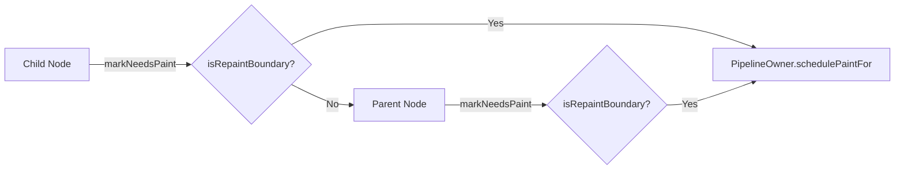

# 更新机制

本文档详细解析 Inkwell 框架的组件更新机制，并结合近期的核心更新说明如何优化渲染性能。

## 1. 更新触发机制

组件更新主要由 `Props` 变化或 `State` 变化触发。

### 1.1 State 变化

当 `StatefulWidget` 调用 `setState` 时，会触发以下流程：

1.  **合并状态**: 新状态合并入当前状态。
2.  **标记脏节点**: 调用 `markDirty()`，将当前组件加入全局 `Runtime` 的脏节点列表 (`dirtyWidgets`)。
3.  **调度更新**: `Runtime` 请求下一帧动画帧 (`requestAnimationFrame`)。
4.  **批量刷新**: 在下一帧开始时，`Runtime` 执行更新消费（内部会循环调用 `rebuild()` 并刷新 Layout/Paint）。

### 1.2 Props 变化

Props 变化通常来自两类来源：
1.  **外部重新渲染**：再次调用 `runtime.render(...)` 传入新的 JSX（或模板函数），Runtime 会重新编译为 `ComponentData` 并更新根节点（可能复用根节点）。
2.  **树内重建传播**：某个节点被标记为脏后，Runtime 在 `rebuild()` 中会对该节点执行子树更新，过程中会触发子节点的 `createElement(...)`，从而把新的 Props/childrenData 下发到子节点。

Props 的落地入口是 `Widget.createElement(...)`：框架在此对比新旧数据，必要时触发 `didUpdateWidget(oldProps)`，并在子节点层面执行“复用/增删/更新”的结构调整。

## 2. 核心更新 API 详解

以下是更新链路中最关键的几组 API。

### 2.1 markDirty()

标记当前组件为"脏"状态，请求重新构建。

- **API**: `markDirty(): void`
- **触发**: 通常由 `setState` 内部自动调用；仅在直接继承 `Widget` 等低层组件中手动调用。
- **机制**:
    1.  将 `_dirty` 标志置为 `true`。
    2.  调用 `runtime.scheduleUpdate(this)` 将自身加入调度队列。
    3.  **关键联动**: 自动调用 `markNeedsLayout()`，因为重建通常意味着布局可能改变。

```typescript
// 示例：StatefulWidget 使用 setState 触发更新（内部会调用 markDirty）
class InteractiveBox extends StatefulWidget<WidgetProps, { highlight: boolean }> {
  state = { highlight: false };

  onHover() {
    this.setState({ highlight: true });
  }
}
```

### 2.2 markNeedsLayout()

标记当前组件布局失效。

- **API**: `markNeedsLayout(): void`
- **触发**: 修改了影响尺寸或位置的属性（如 `width`, `flex`）。
- **机制 (Relayout Boundary)**:
    -   框架会向上查找最近的 **重布局边界 (Relayout Boundary)**。
    -   如果组件自身大小由父级紧约束决定（如 `FixedSize`），它本身就是边界。
    -   **优化**: 只有边界内的子树会重新布局，边界外的父级不受影响。

```typescript
class ResizableBox extends Widget {
  setSize(w, h) {
    this._width = w;
    this._height = h;
    this.markNeedsLayout(); // 仅触发布局与绘制，跳过子树重建
  }
}
```

### 2.3 markNeedsPaint()

标记当前组件需要重绘。

- **API**: `markNeedsPaint(): void`
- **触发**: 修改了仅影响外观不影响布局的属性（如 `color`, `opacity`）。
- **机制**:
    -   将 `_needsPaint` 置为 `true`。
    -   向上递归调用父级的 `markNeedsPaint`，直到遇到 **重绘边界 (Repaint Boundary)**。
    -   **PipelineOwner**: 最终会调用 `owner.schedulePaintFor(boundaryNode)`，将边界节点加入待重绘列表。

#### 更新传播示意图



```typescript
class ColorBox extends Widget {
  setColor(c) {
    this.color = c;
    this.markNeedsPaint(); // 极速更新：无 Build，无 Layout，仅 Paint
  }
}
```

### 2.4 isRepaintBoundary

控制重绘边界的核心属性。

- **类型**: `boolean`
- **默认值**: `false`
- **作用**: 当设置为 `true` 时，该组件会拥有独立的离屏 Canvas (Layer)。
    -   **隔离**: 子组件重绘不影响父组件。
    -   **缓存**: 父组件重绘时，如果该组件未脏，直接合成其缓存的 Canvas，无需重绘子树。

#### 典型应用场景

1.  **复杂子树**: 如包含大量节点的图表、地图。
2.  **频繁更新**: 如秒表、动画光标。
3.  **静态背景**: 内容基本不变的背景层。

```typescript
// 示例：将秒表组件设为重绘边界，避免每秒重绘整个页面
class Stopwatch extends StatefulWidget {
  constructor(props) {
    super(props);
    this.isRepaintBoundary = true; // 开启重绘边界
  }
  // ...
}
```

## 3. 性能对比

理解不同更新方式的开销对于优化应用至关重要。

| 更新方式 | 涉及阶段 | 复杂度 | 推荐场景 |
|----------|----------|--------|----------|
| `markDirty` | Build -> Layout -> Paint | 高 (O(N)) | 结构变化、增删节点 |
| `markNeedsLayout` | Layout -> Paint | 中 (O(logN) ~ O(N)) | 尺寸变化、位置移动 |
| `markNeedsPaint` | Paint | 低 (O(1) ~ O(Subtree)) | 颜色变化、透明度变化 |

> **性能提示**:
> 1. 尽可能使用 `markNeedsPaint` 而非 `markDirty`。
> 2. 合理使用 `isRepaintBoundary` 隔离频繁更新的区域。
> 3. 在不需要改变大小时，尽量使用固定尺寸的组件作为 Relayout Boundary。

## 4. 脏检查与调度

### 脏检查 (Dirty Checking)
Inkwell 的更新调度涉及三类集合/列表：
1.  **Runtime.dirtyWidgets**：需要执行 `rebuild()` 的节点集合（由 `markDirty()` 或 `scheduleUpdate()` 进入）。
2.  **PipelineOwner 的布局脏集合**：需要重新布局的节点集合（由 `markNeedsLayout()` 调度到 Relayout Boundary）。
3.  **PipelineOwner 的绘制脏集合**：需要重绘的节点集合（由 `markNeedsPaint()` 调度到 Repaint Boundary 或相关边界节点）。

### 调度流程 (Pipeline)
一次 Tick 的典型顺序：

1.  **Flush Layout**: 按深度 **从小到大** (浅 -> 深) 处理脏布局节点。确保父节点先计算约束，传递给子节点。
2.  **Flush Paint**: 按深度 **从大到小** (深 -> 浅) 处理脏绘制节点。确保子节点先更新 Layer，父节点合成时能取到最新内容。
