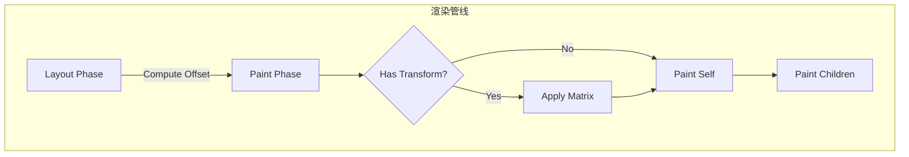
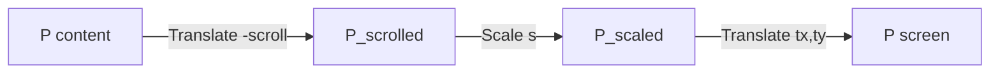

# 视图变换

## 1. 概述

在 Inkwell 框架中，视图变换是指将组件的局部坐标系映射到屏幕（或父容器）坐标系的过程。这一过程对于实现缩放（Zoom）、平移（Pan）、旋转（Rotate）等交互效果至关重要。

本文档详细说明了 Inkwell 中的变换矩阵计算原理、与 Flutter 的对比以及在自定义组件（如 `MindMapViewport`）中的实现方式。

## 2. 变换原理

Inkwell 使用基于步骤（Steps）的变换系统，最终组合成 2D 仿射变换矩阵。

### 2.1 坐标空间

主要涉及以下坐标空间：
*   **屏幕空间 (Screen Space)**: 浏览器视口坐标。
*   **世界空间 (World Space)**: 画布根节点的全局坐标。
*   **视口空间 (Viewport Space)**: `MindMapViewport` 组件自身的局部坐标。
*   **内容空间 (Content Space)**: 被视口包裹的内容（如节点）的坐标。

### 2.2 变换流程

在 Inkwell 中，坐标变换贯穿于渲染管线（Rendering Pipeline）的始终。框架采用**局部坐标系（Local Coordinate System）**优先的设计原则，每个组件只需关心自身的相对位置和大小。

完整的变换流程如下：

1.  **布局阶段 (Layout)**:
    *   父组件决定子组件的 `offset`（相对于父组件的偏移量）。
    *   此 `offset` 存储在 `renderObject.offset` 中。

2.  **绘制阶段 (Paint)**:
    *   **计算世界矩阵**: 当前组件接收父组件传递的 `worldMatrix`，结合自身的 `offset`（及其他变换步骤），计算出当前组件的 `_worldMatrix`。
    *   **应用渲染变换**: 调用渲染器接口（如 `ctx.translate`），将绘图原点移动到组件左上角。
    *   **绘制自身**: 在局部坐标系 (0, 0) 处绘制背景、边框等。
    *   **递归绘制子组件**: 将新的 `worldMatrix` 传递给子组件，重复上述过程。

3.  **事件阶段 (HitTest)**:
    *   将屏幕坐标（全局坐标）通过 `_worldMatrix` 的**逆矩阵**转换为局部坐标。
    *   判断局部坐标是否在组件范围内 (`0 <= x <= width`, `0 <= y <= height`)。



### 2.3 核心算法

Inkwell 使用 3x2 的仿射变换矩阵（Affine Transform Matrix）来描述 2D 空间中的平移、缩放和旋转。

#### 2.3.1 矩阵乘法 (Forward Transform)

从局部空间到世界空间的转换遵循以下公式：

```math
M_{world} = M_{parent} \times M_{local}
```

其中 `$M_{local}$` 通常由组件的布局偏移量 `$T(dx, dy)$` 构成。对于高级组件（如 Viewport），`$M_{local}$` 可能包含缩放 `$S(sx, sy)$` 或旋转 `$R(\theta)$`。

#### 2.3.2 逆矩阵 (Inverse Transform)

用于事件检测（Hit Test）。给定屏幕坐标 `$P_{screen}$`，计算局部坐标 `$P_{local}$`：

$$
P_{local} = M_{world}^{-1} \times P_{screen}
$$

#### 2.3.3 坐标系转换公式

对于点 `$(x, y)$` 应用矩阵 `$[a, b, c, d, tx, ty]$`：

```math
x' = a \cdot x + c \cdot y + tx
y' = b \cdot x + d \cdot y + ty
```

## 3. 源码解析

以下代码用于说明变换逻辑的关键步骤（为便于阅读做了简化）。真实实现请以 [base.ts](file:///Users/edeink/Documents/inkwell/src/core/base.ts) 与 [viewport.ts](file:///Users/edeink/Documents/inkwell/src/core/viewport/viewport.ts) 为准。

### 3.1 Widget.paint (base.ts)

`Widget` 基类负责维护世界矩阵并管理渲染上下文的保存与恢复。

```typescript
// src/core/base.ts

paint(context: BuildContext): void {
  // 1. 获取局部变换步骤 (通常是布局偏移)
  const steps = this.getSelfTransformSteps(); // [{ t: 'translate', x: offset.dx, y: offset.dy }]
  
  // 2. 计算当前节点的世界矩阵
  const prev = context.worldMatrix ?? IDENTITY_MATRIX;
  const next = multiply(prev, composeSteps(steps));
  this._worldMatrix = next; // 缓存矩阵供 HitTest 使用

  // 3. 应用变换到渲染器 (Canvas Context)
  context.renderer?.save?.();
  applySteps(context.renderer, steps);

  // 4. 绘制自身
  this.paintSelf({ ...context, worldMatrix: next });

  // 5. 绘制子组件
  for (const child of this.children) {
    child.paint({ ...context, worldMatrix: next });
  }

  // 6. 恢复渲染器状态
  context.renderer?.restore?.();
}
```

### 3.2 HitTest 实现

利用缓存的世界矩阵进行逆变换，实现精准的点击检测。

```typescript
// src/core/base.ts

public hitTest(x: number, y: number): boolean {
  if (this._worldMatrix) {
    // 1. 计算逆矩阵（并可缓存以减少重复计算）
    const inv = invert(this._worldMatrix);
    // 2. 将全局坐标转换为局部坐标
    const local = transformPoint(inv, { x, y });
    
    // 3. 检查点是否在矩形范围内
    const w = this.renderObject.size.width;
    const h = this.renderObject.size.height;
    return local.x >= 0 && local.y >= 0 && local.x <= w && local.y <= h;
  }
  return false;
}
```

## 4. 视口变换实战（Viewport）

`Viewport` 是一个典型的自定义变换组件，它在标准布局偏移之外，额外引入了“视口变换”（缩放和平移）。

### 4.1 变换逻辑

在 `Viewport` 组件中，变换分为两层：
1.  **自身布局变换**: 决定 Viewport 在父容器中的位置。
2.  **内部视口变换**: 决定子组件（内容）的缩放和平移。

### 4.2 代码实现

```typescript
// src/core/viewport/viewport.ts

paint(context: BuildContext): void {
  // ... (省略自身绘制代码) ...

  // 定义视口变换步骤
  // 注意：Inkwell 的矩阵组合采用“后乘”（m = m * stepMatrix），因此 steps 数组中后面的变换会更早作用于点。
  // 例如：viewSteps = [translate, scale] 组合矩阵是 T * S，对点的效果是“先缩放，再平移”。
  const viewSteps: TransformStep[] = [
    { t: 'translate', x: this._tx, y: this._ty },
    { t: 'scale', sx: this._scale, sy: this._scale },
  ];

  // 应用视口变换到渲染器
  applySteps(context.renderer, viewSteps);

  // 更新子组件的世界矩阵
  const viewLocal = composeSteps(viewSteps);
  // childMatrix = parentMatrix * viewMatrix
  const childMatrix = multiply(this._worldMatrix!, viewLocal);

  // 绘制子组件 (内容)
  // 注意：子组件通常还有自身的滚动偏移 (-scrollX, -scrollY)
  for (const child of children) {
    child.paint({ ...context, worldMatrix: childMatrix });
  }
  
  // ...
}
```

### 4.3 数学验证



假设：
*   Viewport 偏移: $T(tx, ty)$
*   缩放比例: $S(s)$
*   内容滚动偏移: $Offset_{scroll}(-sx, -sy)$
*   内容原始坐标: $P_{content}$

最终屏幕坐标 $P_{screen}$ 计算如下：

$$
P_{screen} = T(tx, ty) \times S(s) \times T(-sx, -sy) \times P_{content}
$$

化简为代数形式：

$$
x_{screen} = (x_{content} - sx) \cdot s + tx
y_{screen} = (y_{content} - sy) \cdot s + ty
$$

这确保了用户在操作缩放和平移时，内容的视觉呈现符合直觉。

## 5. 最佳实践

1.  **缓存矩阵**: `_worldMatrix` 应在每一帧绘制时更新并缓存，避免在 `hitTest` 等高频操作中重复计算矩阵乘法。
2.  **减少嵌套**: 过深的组件嵌套会导致矩阵乘法链过长，虽然计算开销尚可，但可能引入浮点数精度误差。
3.  **使用 `save/restore`**: 修改渲染器变换状态前务必调用 `save()`，操作结束后调用 `restore()`，防止污染兄弟组件的渲染上下文。
4.  **变换顺序**: 牢记变换是不可交换的，并注意 steps 的“后乘”规则：steps 中后面的变换会更早作用于点。要得到“先缩放再平移”的效果，steps 通常写成 `[translate, scale]`。
