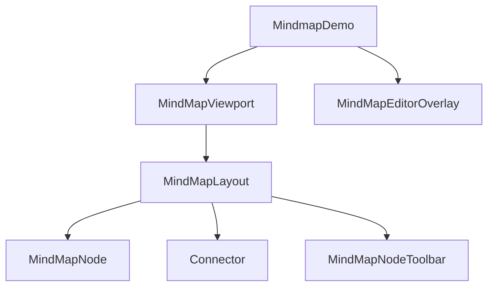

import MindmapDemo from '@mindmap';

# 思维导图

这是一个基于 Inkwell 框架实现的思维导图示例，展示了如何用 Canvas 渲染与 Widget 系统构建高性能、强交互的图形应用。

## 在线演示

```tsx mode:edit
/** @jsxImportSource @/utils/compiler */
<MindmapDemo />
```

### 组件参数 (Props)

该示例组件本身不需要传入参数，会自动适配父容器尺寸并在 `Resize` 时重建渲染树。

## 组件架构



## 功能特性

该示例实现了思维导图的核心功能，包括：

1.  **节点管理**
    *   **根节点 (Root)**: 导图的中心主题。
    *   **子节点 (Child)**: 支持无限层级的子节点扩展。
    *   **同级节点 (Sibling)**: 支持在当前节点上方或下方添加同级节点。
    *   **布局自动调整**: 采用 `MindMapLayout` 实现自动化的树状布局算法（`treeBalanced`），确保节点互不重叠且视觉平衡。

2.  **交互操作**
    *   **缩放与平移 (Zoom & Pan)**: `MindMapViewport` 提供滚轮缩放、拖拽漫游、双指捏合等交互。
    *   **选中与激活**: 点击节点进行激活/选中，框选支持批量选择。
    *   **编辑**: 双击节点文本进行编辑。

3.  **连接线 (Connector)**
    *   使用贝塞尔曲线或折线自动连接父子节点。
    *   样式可配置（粗细、颜色、虚线等）。

## 关键模块

1.  **Widget 层（渲染与命中）**
    *   `src/demo/mindmap/app.tsx`：`MindmapDemo`（`StatefulWidget`），维护图数据、选中与编辑态，并渲染 `MindMapViewport` / `MindMapLayout` / `MindMapNode` / `Connector` 等。
    *   `src/demo/mindmap/widgets/*`：节点、连接线、布局容器、视口，以及编辑器覆盖层等组件。

2.  **算法与基础能力**
    *   `src/demo/mindmap/helpers/layout-engine/*`：树形/平衡树等布局算法。
    *   `src/demo/mindmap/helpers/shortcut/*`：快捷键与历史记录（撤销/重做）。
    *   `src/demo/mindmap/helpers/connection-drawer.ts`：连接线路径与样式计算。
    *   `src/demo/mindmap/helpers/state-helper.ts`：图状态初始化与更新辅助。

3.  **React 入口（仅负责挂载画布）**
    *   `src/demo/mindmap/index.tsx`：挂载 `InkwellCanvas`，创建 `Runtime` 并调用 `runApp`。

## Inkwell 最佳实践

### 1. 状态收敛与受控同步

导图的核心状态集中在 `MindmapDemo（Widget）`：图数据（节点/边）、选中与编辑态，以及 Viewport 的 `scale/tx/ty`。当 Viewport 发生变换时，通过 `onViewChange` 回调同步到 `MindmapDemo` 的状态，确保编辑器覆盖层与命中逻辑在任意缩放下保持一致。

### 2. 自定义布局与零分配思路

`MindMapLayout` 负责在 `performLayout` 中计算子节点偏移与整体尺寸，并在布局完成后通过 `onLayout` 回调驱动“首次居中”等行为。对于高频路径（布局/绘制/命中），优先复用缓存并减少临时对象生成。

### 3. 多坐标系下的命中与交互

导图存在屏幕坐标、Viewport 局部坐标与世界坐标的转换。示例中将坐标变换收敛在 Viewport 的辅助方法与少量工具函数中，确保框选、节点命中与缩略图拖拽在任意缩放比例下都能正确工作。

### 4. 类型安全的组件查找 (Type-Safe Component Lookup)
在大型应用中，通过字符串查找组件（`findWidget`）容易出错且难以维护。本项目强制使用枚举（Enum）来管理组件类型。
- **定义**: 在 `type.ts` 中定义 `CustomComponentType` 枚举。
- **使用**: 在 `findWidget` 和 `key` 属性中统一使用枚举值，严禁硬编码字符串（如 `'#MindMapViewport'`）。
- **示例**:
  ```typescript
  // ❌ 错误：硬编码字符串
  findWidget(root, '#MindMapViewport');
  
  // ✅ 正确：使用枚举
  import { CustomComponentType } from './type';
  findWidget(root, `#${CustomComponentType.MindMapViewport}`);
  ```

## 代码结构

*   `src/demo/mindmap/index.tsx`: React 挂载入口（创建 Runtime 并调用 `runApp`）。
*   `src/demo/mindmap/app.tsx`: 画布场景（`StatefulWidget`）与核心状态管理。
*   `src/demo/mindmap/widgets/`: Viewport、Layout、Node、Connector、编辑器覆盖层等渲染组件。
*   `src/demo/mindmap/helpers/`: 布局引擎、快捷键、连接线绘制、状态辅助等。
