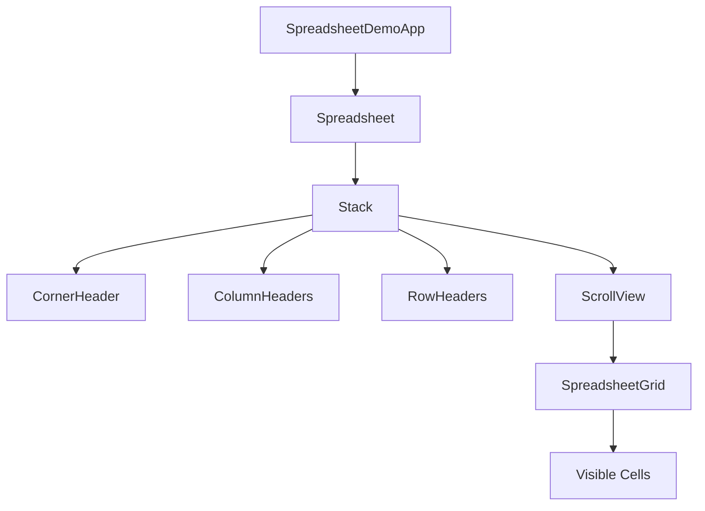

import { SpreadsheetDemoApp } from '@demo/spreadsheet/app';

# 电子表格

这是一个基于 Inkwell 框架实现的高性能电子表格示例，展示了如何处理大量数据、复杂交互以及自定义布局逻辑。

## 在线演示

```tsx mode:edit
/** @jsxImportSource @/utils/compiler */
<SpreadsheetDemoApp width={800} height={600} />
```

### 组件参数 (Props)

| 属性 | 类型 | 默认值 | 说明 |
| :--- | :--- | :--- | :--- |
| `width` | `number` | `800` | 表格总宽度 |
| `height` | `number` | `600` | 表格总高度 |
| `theme` | `ThemePalette` | `Themes.light` | 主题配置（支持深色模式） |
| `dataVersion` | `number` | - | 数据版本号，用于触发外部数据更新时的重绘 |

## 组件架构



## 功能特性

该示例实现了电子表格的核心功能，包括：

1.  **高性能渲染 (Virtualization)**
    *   支持百万级行数据的虚拟滚动。
    *   只渲染视口（Viewport）内的单元格，确保极低的内存占用和流畅的滚动体验。
    *   使用 `ScrollView` 组件处理滚动逻辑，配合 `SpreadsheetGrid` 进行按需渲染。

2.  **数据模型 (Data Model)**
    *   **稀疏矩阵存储**: 使用 `Map<string, CellData>` 存储单元格数据，避免为空白单元格分配内存。
    *   **尺寸管理**: 使用 `SizeManager` 高效管理行高和列宽，支持默认尺寸和自定义尺寸的混合查找（O(log N) 或 O(K)）。

3.  **公式计算 (Formula Engine)**
    *   支持基础公式输入（如 `=A1+B2`）。
    *   支持单元格引用解析和递归计算。
    *   **注意**: 演示版仅支持基础四则运算，未处理循环引用。

4.  **交互操作**
    *   **单元格选择**: 点击选择单个单元格，支持行列头部点击选中整行/整列。
    *   **编辑**: 双击单元格进入编辑模式（使用 `EditableText` 组件）。
    *   **调整尺寸**: 拖拽行号或列标边缘调整行高/列宽。

## Inkwell 最佳实践

本示例展示了 Inkwell 框架在处理复杂数据类应用时的优势：

### 1. 绝对定位布局 (Absolute Layout)

电子表格是一个典型的绝对定位场景。我们没有使用 Flex 布局，而是根据 `SizeManager` 计算出的 `offset` 直接控制每个单元格的 `left` 和 `top`。

```typescript
// 伪代码示例
const rowTop = model.getRowOffset(r);
const colLeft = model.getColOffset(c);

<Positioned left={colLeft} top={rowTop} width={w} height={h}>
  <Cell />
</Positioned>
```

### 2. 状态分离与按需更新

为了保证性能，我们将数据模型 (`SpreadsheetModel`) 与 UI 组件分离。
*   `Spreadsheet` 组件持有 Model 和 Viewport 状态（滚动位置）。
*   `SpreadsheetGrid` 组件只负责根据当前视口渲染可见区域。

### 3. 事件处理

利用 Inkwell 的事件系统处理复杂的鼠标交互：
*   `onPointerDown`: 处理单元格选中和拖拽调整尺寸的开始。
*   `onPointerMove`: 处理拖拽过程中的尺寸实时更新。
*   `onPointerUp`: 结束拖拽操作。

### 4. 主题适配

通过 `ThemePalette` 接口实现深色模式的无缝切换，所有颜色值（背景、边框、文字）都从主题变量中获取，而非硬编码。
