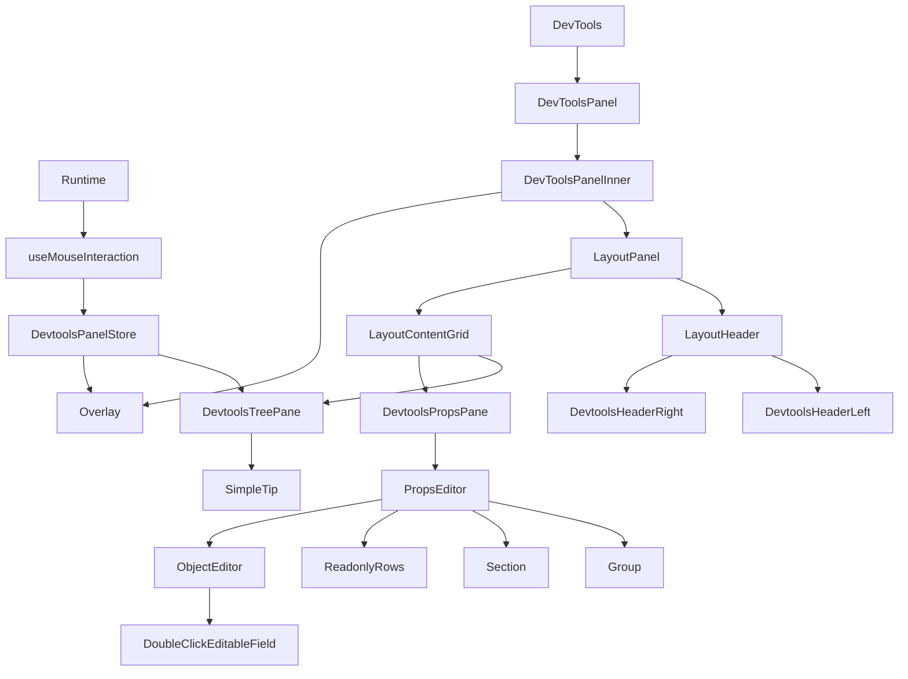

# Inkwell DevTools

Inkwell DevTools 是 `@edeink/inkwell` 框架的调试工具，提供组件树查看、属性编辑、元素高亮与交互式拾取功能。

## 1. 项目整体架构

DevTools 采用 React + Ant Design 构建，作为一个独立的覆盖层（Overlay）挂载到应用中。它通过 `Runtime` 单例与核心框架进行通信。

- **入口层**: `src/devtools/index.tsx`。负责单例管理 (`Devtools` class) 和 React 根节点挂载。
- **UI 层**: `src/devtools/components/`。包含面板布局 (`LayoutPanel`)、树视图、属性编辑器等。
- **逻辑层**: `src/devtools/hooks/`。`useMouseInteraction` 处理画布交互，`useDevtoolsHotkeys` 处理快捷键。
- **数据转换**: `src/devtools/helper/tree.ts`。将 Inkwell Widget 树转换为 UI 可用的树结构。

## 2. 主要组件及其功能

| 组件 | 路径 | 描述 |
| --- | --- | --- |
| **DevTools** | `src/devtools/index.tsx` | 对外暴露的 React 组件，作为单例的启动入口。 |
| **DevToolsPanel** | `src/devtools/components/devtools-panel/index.tsx` | 核心面板组件，包含树、搜索、交互逻辑。 |
| **LayoutPanel** | `src/devtools/components/layout/index.tsx` | 提供可拖拽、停靠 (Dock) 的布局容器。 |
| **Overlay** | `src/devtools/components/overlay/index.ts` | 负责在 Canvas 上绘制高亮边框和提示信息。 |
| **PropsEditor** | `src/devtools/components/props-editor/index.tsx` | 显示并编辑当前选中 Widget 的属性。 |

## 3. 核心 API 接口

### `Devtools` (Singleton Class)
管理 DevTools 面板的生命周期。

- `getInstance(props?)`: 获取或创建单例。
- `show() / hide()`: 控制面板显示/隐藏。
- `dispose()`: 销毁实例，清理 DOM。
- `update(props?)`: 更新属性。

### `useMouseInteraction` (Hook)
处理鼠标在 Canvas 上的移动和点击事件。

- **输入**: `runtime`, `overlay`, `active` (是否开启 inspect)。
- **输出**: `onPick` (选中回调), `runtimeId` (当前画布 ID)。
- **功能**: 利用 `hitTest` 识别鼠标下的 Widget，并调用 `overlay` 高亮。

## 4. 重要数据结构和状态管理

### Widget Tree Transformation
- **`Widget` (Core)**: 运行时组件节点。
- **`DevTreeNode` (DevTools)**: 轻量级树节点，用于 Antd Tree 展示。
  ```ts
  type DevTreeNode = {
    key: string;
    type: string;
    props?: Record<string, unknown>;
    children: DevTreeNode[];
  };
  ```

### State Management（MobX）
DevTools 采用 MobX 进行状态集中化管理，通过 RootStore 统一注入与响应式更新。
- `DevtoolsRootStore`: 统一管理面板状态与布局状态，负责生命周期与调试接入。
- `DevtoolsPanelStore`: 组件树、拾取、Overlay、运行时与可见性等核心状态。
- `DevtoolsLayoutStore`: Dock 布局、分割尺寸与窄屏状态，统一持久化策略。
状态流转通过 `action` 统一修改，视图层通过 `observer` 获取响应式更新，避免跨组件的重复 `useState`。

## 5. 关键业务逻辑流程

### Inspect (拾取) 流程
1. 用户点击 "Inspect" 按钮 (`activeInspect = true`)。
2. `useMouseInteraction` 监听 `mousemove`。
3. 调用 `Runtime` 的 `hitTest` 获取鼠标下的 Widget。
4. 调用 `Overlay.highlight(widget)` 绘制高亮框。
5. 用户点击 `click` -> 触发 `onPick(widget)`。
6. `DevToolsPanel` 更新 `selected`，计算路径并展开树节点 (`setExpandedKeys`)。
7. `Tree` 组件滚动到对应节点。

### Tree 联动流程
1. `Runtime` 发生变化 (如 `rebuild`)。
2. `DevToolsPanel` 重新计算 `treeData` (`toTree`)。
3. `Tree` 组件刷新展示。
4. 用户在 `Tree` 中 Hover/Select -> 触发 `findWidget` 查找 Widget -> 调用 `Overlay` 高亮。

## 6. 组件架构与嵌套关系

### 6.1 层级结构

- DevTools（入口组件）
  - DevToolsPanel
    - DevToolsPanelInner
      - Overlay（选中高亮）
      - LayoutPanel（布局容器）
        - LayoutHeader
          - DevtoolsHeaderLeft（拾取开关）
          - DevtoolsHeaderRight（帮助/关闭）
        - LayoutContentGrid
          - DevtoolsTreePane
            - SimpleTip（多运行时提示）
          - DevtoolsPropsPane
            - PropsEditor
              - Group / Section / ReadonlyRows
              - ObjectEditor
                - DoubleClickEditableField

### 6.2 组件与数据流 Mermaid



### 6.3 组件清单与关键接口

| 组件 | 入口文件 | 作用 | 关键 props/events | 测试文件 |
| --- | --- | --- | --- | --- |
| DevTools | `src/devtools/index.tsx` | Devtools 入口与单例挂载 | `onClose`、`shortcut` | `src/devtools/__tests__/singleton.spec.tsx` |
| DevToolsPanel | `src/devtools/components/devtools-panel/index.tsx` | 创建 RootStore 并渲染面板 | `onClose`、`shortcut` | 无 |
| DevToolsPanelInner | `src/devtools/components/devtools-panel/panel-inner/index.tsx` | 组合布局与 Overlay | `helpContent` | 无 |
| LayoutPanel | `src/devtools/components/layout/index.tsx` | 面板布局与拖拽 | `visible`、`treePaneProps`、`propsPaneProps`、`onVisibleChange` | 无 |
| LayoutHeader | `src/devtools/components/layout/header/index.tsx` | Dock 切换与右侧扩展区 | `dock`、`onDockChange`、`onRequestClose` | 无 |
| LayoutContentGrid | `src/devtools/components/layout/content-grid/index.tsx` | 树/属性面板分割布局 | `info`、`treePaneProps`、`propsPaneProps`、`onSplitMouseDown` | 无 |
| LayoutResizeHandle | `src/devtools/components/layout/resize-handle/index.tsx` | 面板尺寸拖拽柄 | `cursor`、`onResizeMouseDown` | 无 |
| DevtoolsHeaderLeft | `src/devtools/components/devtools-panel/header-left/index.tsx` | 拾取开关按钮 | `activeInspect`、`onToggleInspect` | 无 |
| DevtoolsHeaderRight | `src/devtools/components/devtools-panel/header-right/index.tsx` | 帮助与关闭按钮 | `helpContent`、`onRequestClose` | 无 |
| DevtoolsTreePane | `src/devtools/components/devtools-panel/tree-pane/index.tsx` | 树视图与搜索 | `treeData`、`selectedKey`、`onSelectKey`、`onHoverKey` | 无 |
| DevtoolsPropsPane | `src/devtools/components/devtools-panel/props-pane/index.tsx` | 属性面板容器 | `widget`、`onApply` | 无 |
| PropsEditor | `src/devtools/components/props-editor/index.tsx` | 属性/状态编辑 | `widget`、`onChange` | 无 |
| Group | `src/devtools/components/props-editor/group/index.tsx` | 分组容器 | `title`、`children` | 无 |
| Section | `src/devtools/components/props-editor/section/index.tsx` | 分区容器 | `title`、`children` | 无 |
| ReadonlyRows | `src/devtools/components/props-editor/readonly-rows/index.tsx` | 只读行布局 | `items` | 无 |
| ObjectEditor | `src/devtools/components/object-editor/index.tsx` | 对象 KV 编辑 | `value`、`onChange`、`readOnly` | 无 |
| DoubleClickEditableField | `src/devtools/components/double-click-field/index.tsx` | 双击编辑字段 | `display`、`editor`、`editable` | 无 |
| SimpleTip | `src/devtools/components/simple-tip/index.tsx` | 提示图标与说明 | `message` | 无 |
| Overlay | `src/devtools/components/overlay/index.tsx` | Canvas 高亮覆盖层 | `runtime`、`active`、`widget` | `src/devtools/__tests__/overlay-highlight-dedupe.spec.tsx` |
